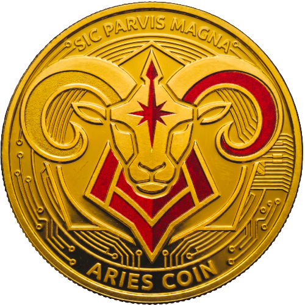

<p align="center">
  
</p>

# Aries Chain

**The automated utility blockchain.** A high-performance, Byzantine
fault-tolerant proof-of-stake ledger with full EVM compatibility — built for
sub-second, low-cost payments, validator staking, and everyday on-chain
utility use cases.

| | |
|---|---|
| Network | Aries |
| Chain ID | `232425` |
| Native currency | ARES (`aares`, 18 decimals) |
| Public RPC | `https://rpc.arieschain.org` |
| Explorer | `https://scan.arieschain.org` |
| Min. validator self-stake | 51,000 ARES |

> [!IMPORTANT]
> This repository is under active development. Expect breaking changes
> between releases until a stable v1 is tagged.

## Run a validator

The fastest path to a running node is the validator kit and step-by-step
guide at **[arieschain.org/run-a-validator](https://arieschain.org/run-a-validator)** —
it covers preparing a VPS, joining the network, and safely backing up your
keys. The live validator set is visible at
[arieschain.org/validators](https://arieschain.org/validators).

To build `ariesd` directly from this repository instead:

```bash
cd evmd
CGO_ENABLED=1 go build -o build/ariesd ./cmd/ariesd
```

Or run a local single-node devnet for development:

```bash
./local_node.sh
```

## EVM compatibility

Aries runs a complete Ethereum Virtual Machine alongside its native consensus
layer, so existing Ethereum tooling works unmodified:

- Standard Ethereum JSON-RPC, compatible with wallets (MetaMask, Rabby) and
  block explorers (Blockscout)
- Solidity smart contracts deploy without modification — Hardhat, Foundry,
  and Remix all work out of the box
- On-chain precompiles expose native staking, distribution, and governance
  functionality directly to Solidity contracts
- EIP-1559 fee market and EIP-712 typed-data signing, so Cosmos-style
  transactions can be signed with an EVM wallet
- Full IBC support, so IBC assets are usable directly from the EVM side

## Testing

All test targets live in the root `Makefile`.

```bash
make test-unit          # unit tests
make test-unit-cover     # coverage report (filtered_coverage.txt)
make test-fuzz           # fuzz tests
make test-solidity       # Solidity/precompile tests
make benchmark           # benchmark suite
```

## Migrations

Upgrade guides between versions live under [`docs/migrations`](./docs/migrations).

## Contributing

See [`CONTRIBUTING.md`](./CONTRIBUTING.md) for pull request guidelines.

## License

Aries Chain is released under the [Apache License 2.0](./LICENSE). It builds
on open-source Cosmos SDK ecosystem technology; see [`NOTICE`](./NOTICE) for
required upstream attribution.
