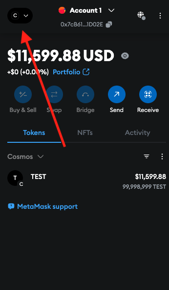
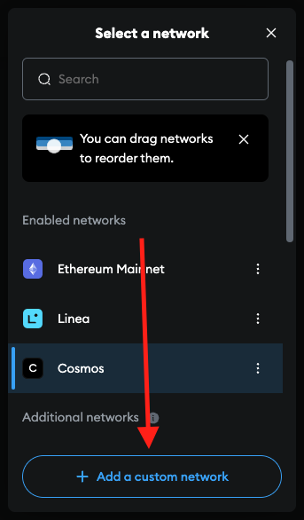
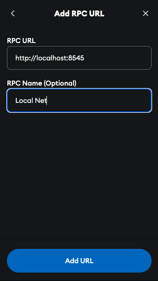
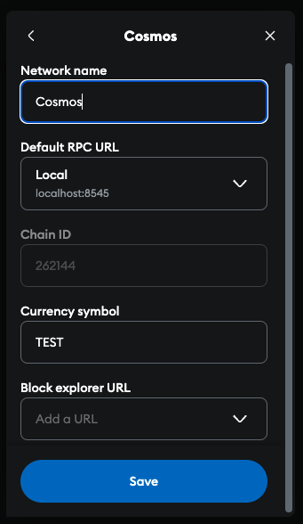

# Aries Chain — evmd

This directory contains `ariesd`, the Aries Chain node binary. It is based on
a Cosmos SDK `simapp`-style application layout.

This directory is also used to provide a chain object for testing purposes
within the repository.

## Config

Running the local dev script (below) defaults to Aries's actual production
parameters:

| Option              | Value                  |
|---------------------|------------------------|
| Binary              | `ariesd`               |
| Chain ID            | `232425`               |
| Custom Opcodes      | -                      |
| Default Token Pairs | 1 for the native token |
| Denomination        | `aares`                |
| EVM permissioning   | permissionless         |
| Enabled Precompiles | all                    |

## Running The Chain

To run a local single-node dev chain, execute the script found within this repository:

```bash
./local_node.sh [FLAGS]
```

Available flags are:

- `-y`: Overwrite previous database
- `-n`: Do **not** overwrite previous database
- `--no-install`: Skip installation of the binary
- `--remote-debugging`: Build a binary suitable for remote debugging

## Connect to Wallet

For local development, we'll be using Metamask:

1. Use the following seed phrase when adding a new wallet — this is a
   well-known, public local-devnet test mnemonic, not a real account:
`gesture inject test cycle original hollow east ridge hen combine
junk child bacon zero hope comfort vacuum milk pitch cage oppose
unhappy lunar seat`
2. On the top left of the Metamask extension, click the Network button.
3. Click Add custom network from the bottom of the modal.
4. Under Default RPC URL, add the RPC URL as http://localhost:8545. Ensure your chain is running.
5. Once added, copy the rest of the settings shown in the below images.






To connect to the **live public network** instead of a local devnet, see
[arieschain.org/run-a-validator](https://arieschain.org/run-a-validator) for
the real chain ID, RPC endpoint, and seed peer.

## Available Cosmos SDK Modules

This chain implementation is a reduced version of `simapp`.
Specifically, instead of offering access to all Cosmos SDK modules, it just includes the following:

- `auth`
- `authz`
- `bank`
- `capability`
- `consensus`
- `distribution`
- `evidence`
- `feegrant`
- `genutil`
- `gov`
- `mint`
- `params`
- `slashing`
- `staking`
- `upgrade`
